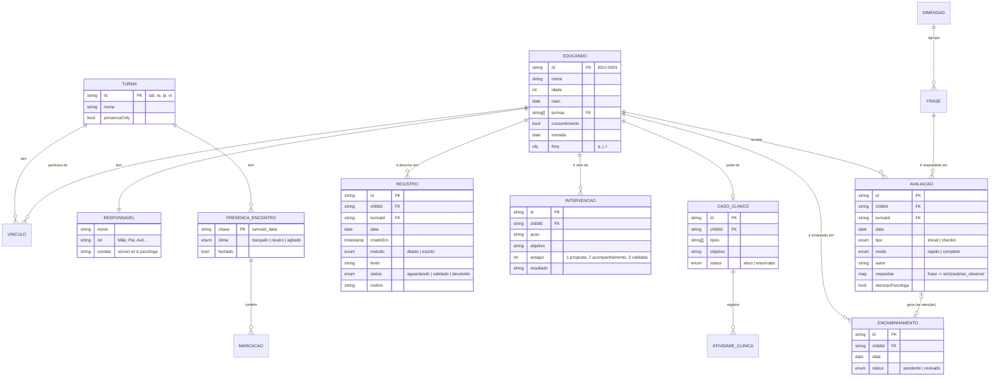

# Modelo de dados — Ebenézer Conecta v1.0

Todo o estado da aplicação é um único objeto `DB`, serializado em JSON no `localStorage` do navegador (chave `ebenezer-conecta-v7`). Ele é criado pela função `seedDB()` em `index.html` e salvo por `saveDB()` a cada ação.

## Diagrama entidade-relacionamento

## Dicionário das coleções

| Coleção (`DB.*`) | O que guarda | Campos principais | Regras |
|---|---|---|---|
| `children` | Cadastro único do educando | `id` (EDU-xxxx), `nome`, `idade`, `nasc`, `resp{nome,rel,contato}`, `turmas[]`, `consentimento`, `entrada`, `freq{p,j,t}` | Uma criança em duas turmas conta **uma vez** (vínculos são o par criança×turma). Sem `consentimento`, avaliação é bloqueada e a criança sai do agregado do relatório. |
| `avaliacoes` | Direct Behavior Rating (DBR) | `childId`, `turmaId`, `data`, `tipo`, `modo`, `respostas{}`, `atencaoPsicologa` | A 1ª avaliação de cada vínculo é `inicial`; as seguintes, `checkin`. Modo rápido = 5 frases; completo = 16. Cada resposta: `sim`, `nao` ou `nao_observei`. |
| `registros` | Observação descritiva da equipe | `texto`, `metodo`, `status`, `motivo`, `criadoEm` | Todo registro nasce `aguardando` e só conta após a coordenação `validar`. Se `devolvido`, a correção volta para `aguardando`. Edição livre por 15 min. |
| `intervencoes` | Ação pedagógica proposta | `acao`, `objetivo`, `estagio`, `resultado` | Estágio 1 → 2 → 3; só a coordenação avança e valida. |
| `encaminhamentos` | Sinalizador para a psicóloga | `childId`, `data`, `status` | Criado automaticamente quando a avaliação marca "atenção da psicóloga". Não guarda motivo escrito. Só a psicóloga vê. |
| `casos` | Prontuário psicológico (estrutura CRP) | `tipos[]`, `descricao`, `objetivo`, `status`, `atividades[]` | Exclusivo da psicóloga. Cada atividade: data, tipo, procedimentos, evolução, demandas e encaminhamento externo opcional. |
| `presencas` | Lançamento por encontro e registro do grupo | chave `turmaId_data` → `{clima, fechado, marks{childId: presente\|justificada\|falta}, grupo{atividades[], engaj, movimentos[], obs, autor, em}}` | Depois de fechado, só a coordenação reabre a presença; o registro do grupo continua editável. `grupo` é coletivo e sem nome de criança (o app avisa). Em Vivência Terapêutica e Começos que Protegem (`lider: 'psicologa'`), só a psicóloga registra e lê o conteúdo; `movimentos[]` existe só nesses grupos. |
| `frases` | As 16 frases-fato das avaliações | `k`, `t`, `dim`, `quick`, `versao`, `atualizadoEm` | Editáveis pela psicóloga; cada edição incrementa a versão. |
| `auditLog` | Trilha de auditoria | `ts`, `texto` | Toda ação sensível gera uma linha (consentimento, validação, devolução, avaliação, intervenção, caso). |

## As 16 frases em 5 dimensões (CASEL + BNCC)

| Dimensão | Frases (★ = também no modo rápido) |
|---|---|
| Eu e minhas emoções | Disse como se sentia · Se acalmou sozinho(a) · Mostrou o próprio trabalho · Falou de si de forma positiva |
| Eu e os outros | ★ Ajudou sem pedirem · Dividiu material · ★ Entrou em conflito · ★ Resolveu conversando |
| Eu e a atividade | ★ Participou do começo ao fim · Tentou de novo após errar · Pediu ajuda · Ficou fora do grupo |
| Eu e o combinado | Cumpriu o combinado · Cuidou do material e do espaço |
| O que a gente fez | ★ Intervenção aplicada · Clima do encontro foi positivo |

## Regras calculadas (sem IA)

- **Frequência considerada** = (presenças + faltas justificadas) ÷ encontros. Boa ≥ 75%, média ≥ 50%, baixa < 50%.
- **Recorrência de falta justificada**: 3 ou mais → alerta de possível vulnerabilidade, acompanhado à parte.
- **Status por dimensão** (Avanço / Estável / Atenção): compara a proporção de "sim" na primeira e na última avaliação.
- **Escala de autonomia**: Acolhimento (< 2 evidências), Desenvolvimento (2–4), Autonomia (≥ 5).
- **Semáforo de turma**: "atenção" se houver educando sem consentimento ou frequência média < 75%; "dados insuficientes" com menos de 3 educandos.

## Relatório básico (versão 1.2.0)

| Bloco | Como é calculado |
|---|---|
| Crianças atendidas e frequência | Vínculos do programa; frequência considerada (falta justificada não pesa). |
| Encontros com registro do grupo | `presencas[programa_data].grupo` preenchido. |
| O que foi trabalhado | Contagem das atividades marcadas no registro do grupo. Nos grupos da psicóloga, não aparece. |
| Primeiros sinais de evolução | Para cada criança com consentimento e duas avaliações ou mais no programa, compara a resposta inicial de cada frase com a mais recente respondida. Avanço = passou ao comportamento desejado (em "Entrou em conflito" e "Ficou fora do grupo", o desejado é "não"). A dimensão "O que a gente fez" é contexto e fica de fora. Só aparece com **5 crianças ou mais** com duas avaliações, para não identificar ninguém. |
| Texto para apoiadores | Gerado a partir dos blocos acima, sem nomes, com a ressalva de leitura preliminar. |

## Massa de dados sintéticos

Todos os nomes, datas e telefones são **fictícios**. A carga inicial cobre os cinco programas e todos os estados de cada fluxo:

| Entidade | Qtd. | Cobertura |
|---|---|---|
| Educandos | 18 | 5 programas (Laboratório 11, Reforço 6, Primeira Infância 4, Vivência Terapêutica 3, Começos que Protegem 5 vínculos); 4 sem consentimento; idades de 4 a 11 anos |
| Registros do grupo | 3 | Começos que Protegem e Vivência Terapêutica (psicóloga) e Laboratório de Sonhos (equipe) |
| Avaliações | 19 | iniciais e check-ins, modos rápido e completo, 1 com sinalização; 5 crianças do Laboratório com inicial e acompanhamento, base mínima do relatório básico |
| Registros | 9 | aguardando, validado e devolvido; ditado e escrito |
| Intervenções | 3 | em acompanhamento e concluída |
| Encaminhamentos | 4 | pendente e revisado |
| Casos clínicos | 1 | ativo, com 2 atividades |
